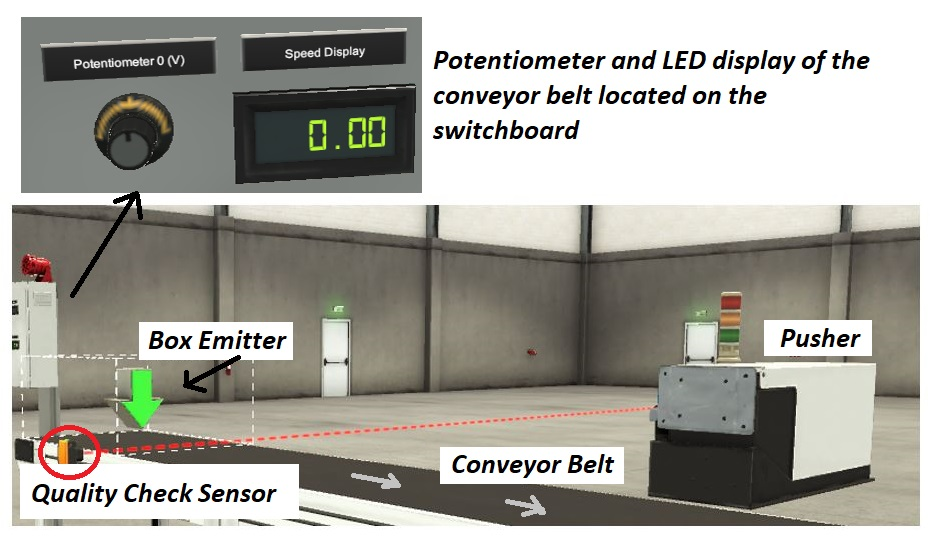
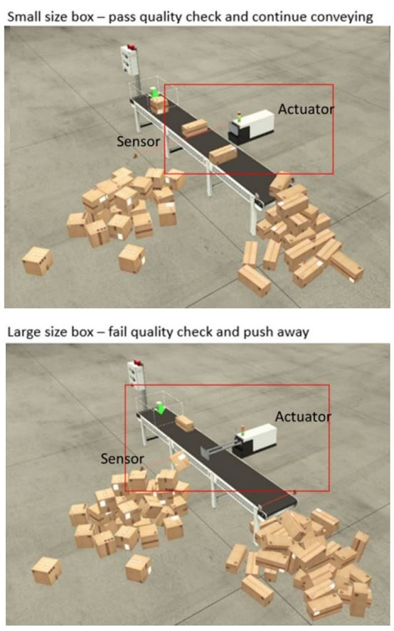
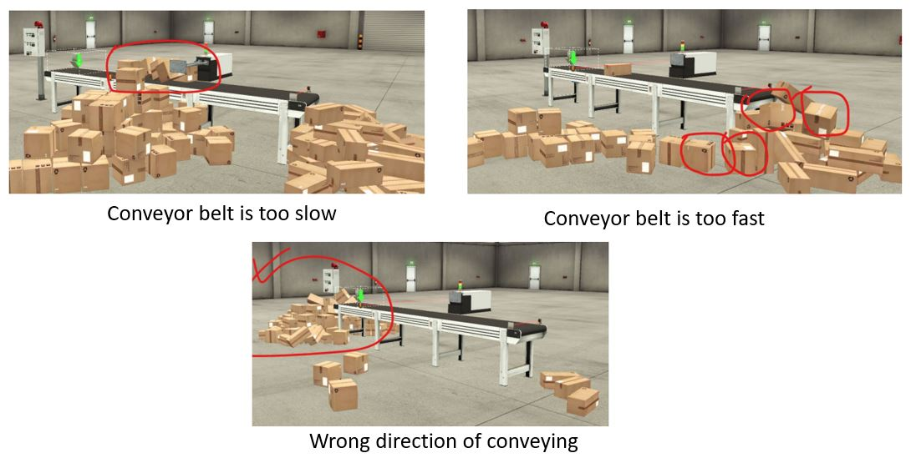

# Project Title
Digital Twins of Cyber-Physical Systems in Smart Manufacturing: Threat Simulation and Detection via Deep Learning for Time Series Classification

# Project Aim
Our research aims to overcome the limitations of physical testbeds and challenges of data scarcity for Machine Learning (ML) or Deep Learning (DL) model development. 

By leveraging Digital Twins for data-driven analysis, this study proposes the use of supervised DL techniques for accurate threat detection and classification in CPS within smart manufacturing. 

# [New] Sample Video on the Simulation conducted in Factory I/O 
https://vimeo.com/1028776456

# [New] Research Paper
C. Lo, T. Y. Win, Z. Rezaeifar, Z. Khan and P. Legg, "Digital Twins of Cyber Physical Systems in Smart Manufacturing for Threat Simulation and Detection with Deep Learning for Time Series Classification," 2024 29th International Conference on Automation and Computing (ICAC), Sunderland, United Kingdom, 2024, pp. 1-6, doi: 10.1109/ICAC61394.2024.10718749. keywords: {Deep learning;Time series analysis;Threat assessment;Data models;Digital twins;Safety;Fourth Industrial Revolution;Security;Scenario generation;Smart manufacturing;digital twin;testbed;cyber security;threat simulation and detection;cyber physical systems},

# Overview of the Digital Twins Testbed Setup

This GitHub repository provides a Proof-of-Concept (POC) about the setup of the Digital Twins testbed. The setup guide enables the cybersecurity community to replicate and broaden our methodology, thus enhancing security measures in smart manufacturing ecosystems.

## Hardware and Software Required

You will need the following hardware and software for setting up the Digital Twins testbed:

- [Factory I/O 3D Simulator](https://factoryio.com/) (30-day free trial for Ultimate Edition, the monthly licence fee for Ultimate Edition is €28. There are many [readily made scene in Factory I/O](https://docs.factoryio.com/getting-started/opening-a-scene/). This project build a quality checking scene from scratch.)

- [OpenPLC Programmable Logic Controller Simulator](https://autonomylogic.com/) (completely free of charge. Thanks [Dr. Thiago Alves](https://www.linkedin.com/in/thiago-alves-phd-23740743/) for providing a low cost industrial PLC for automation and research.)

- [Raspberry Pi](https://www.raspberrypi.com/products/) for hosting OpenPLC (At the moment, Raspberry Pi 4 is the most stable platform for OpenPLC, it costs around £60. OpenPLC is yet to work on Raspberry Pi 5 due to dependency on [WiringPi](https://github.com/WiringPi/WiringPi). If you like, you could also use other microcontrollers such as Arduino to set up the PLC simulator with OpenPLC. Another option is using [industrial grade PLC](https://docs.factoryio.com/getting-started/controlling-with-a-plc/), such as those manufactured by Siemens, Allen-Bradley, to replace OpenPLC but it would be comparatively expensive than using OpenPLC)

## Installation and setup guide

### (a) Setup OpenPLC on Raspberry Pi
1) Install and run Raspberry Pi OS ([Debian Bullseye with Raspberry Pi Desktop](https://www.raspberrypi.com/software/operating-systems/) on Raspberry Pi 4 
2) Install and setup OpenPLC Runtime on Raspberry Pi 4. Refer to [installation manual](https://autonomylogic.com/docs/installing-openplc-runtime-on-linux-systems/) and [OpenPLC YouTube videos](https://www.youtube.com/@openplc/videos) for explanation. Refer to [settings for Slave Device on OpenPLC](OpenPLCslave.PNG) for more details.
3) Unzip [FactoryIO_E1.zip](FactoryIO_E1.zip) to get the Factory I/O runtime file, upload the program named 655575.st onto OpenPLC Runtime.

### (b) Setup Factory I/O 
1) Install and run Factory I/O on computer that meets the [system requirements](https://factoryio.com/start-trial)
2) Download and open the [FactoryIOE1_5V.factoryio](FactoryIOE1_5V.factoryio). It is a quality checking scene that we have created.
3) Start the connection and run the file. Refer to the [UWECyber YouTube playlist](https://www.youtube.com/playlist?list=PLqaj1AbWsq7ueS2nn_PImJG2-4CWEPxNQ) if you want to learn more about how to run your own Factory I/O scenes.
4) Turn on Web server in Factory I/O with the app.web_server = True on [Factory I/O's console](https://docs.factoryio.com/manual/console/).

*The Core Elements of Factory I/O Testbed*

# Threat Simulation and Data Collection
1) You can [manually control the scene](https://docs.factoryio.com/getting-started/manually-controlling-scene/) or via the OpenPLC Monitoring page.
2) During the simulation, run the [data collector python script](data_collector_enhanced.py). It will scrape data from [Factory I/O's API](https://docs.factoryio.com/manual/web-api/). Amend the code if you want to collect more or less data. You will get a csv file after 1 minute of simulation.
3) After all your simulations, run the [combineCSV python script](combineCSV.py) to merge all csv file into 1 file.
4) Filter the data with [filtering script](combined_dataset_filtered.py). The raw data file is named "Raw data.zip" for your reference.
5) Check if there are any missing records or errors. If no, the csv file is ready for your threat detection.
6) The file ready for you to train your threat detection tool is named [factoryiodata.csv](factoryiodata.csv).

*Automation Task in the Factory I/O Quality Checking Scene*

# Threat Detection
We have used [sktime](https://github.com/sktime/sktime) to train and test time series classifers with the csv dataset. Refer to the Google Colab notebooks (.ipynb files) in this GitHub for the details. 

Our detection tool is trying to detect the following cases:
- Label #1 - 'Sensors_NormalSpeed': use potentiometer with normal conveyor speed.
- Label #2 - 'Sensors_TooSlowOrStop':use potentiometer with conveyor speed too slow or stopped.
- Label #3 - 'Sensors_Oscillate': use potentiometer with conveyor speed up and down illogically.
- Label #4 - 'Sensors_WrongDirection': use potentiometer with conveyor going the reverse direction.
- Label #5 - 'ForcedActuator_Normal': force actuator value with normal conveyor speed.
- Label #6 - 'ForcedActuator_TooSlowOrStop': force actuator value with conveyor speed too slow or stopped.
- Label #7 - 'ForcedActuator_TooFast': force actuator value with conveyor speed too fast.
- Label #8 - 'ForcedActuator_ExtremelyFast': force actuator value with conveyor speed extremely fast.
- Label #9 - 'ForcedActuator_Oscillate': force actuator value with conveyor speed up and down illogically.
- Label #10 - 'ForcedActuator_WrongDirection': force actuator value with conveyor going the reverse direction.

Refer to [Model Pickle.zip](Model%20Pickle.zip) for the saved model.

*Impact of Manipulating the Conveyor Belt's Speed or Direction*

